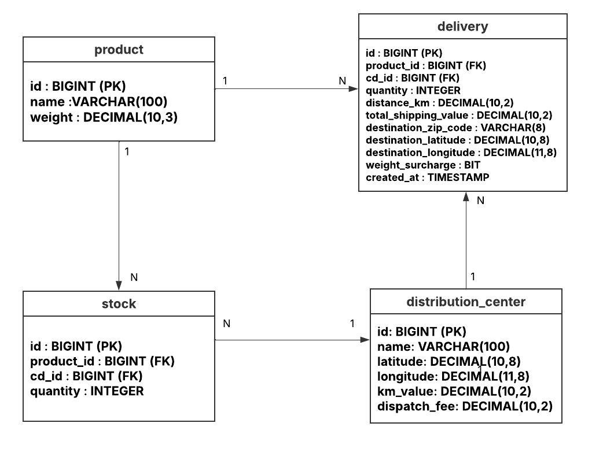

# Rota Inteligente API

Microsserviço de precificação de frete baseado em **rotas rodoviárias reais**. Diferente de calculadoras que usam distância em linha reta, o sistema integra APIs de geolocalização e roteamento para gerar um custo que reflete a realidade da malha viária brasileira.

---

## Requisitos Funcionais

**Cadastros**
- RF01 — Cadastrar, consultar, atualizar e desativar Centros de Distribuição com nome, coordenadas, valor por KM e taxa de despacho
- RF02 — Cadastrar produtos com nome e peso (o peso define o multiplicador de custo)
- RF03 — Associar produtos a CDs com quantidade disponível por unidade

**Inteligência e Integração**
- RF04 — Converter o CEP de destino em coordenadas geográficas via BrasilAPI
- RF05 — Calcular a distância real por estradas entre CD e destino via OSRM
- RF06 — Selecionar automaticamente o CD com estoque suficiente e menor distância real até o destino

**Negócio e Transação**
- RF07 — Calcular o frete aplicando a fórmula: `(Distância_km × ValorKM × MultiplicadorPeso) + TaxaDespacho` — MultiplicadorPeso: 1.0 para < 10 kg e 1.2 para >= 10 kg
- RF08 — Reduzir o estoque do CD selecionado ao confirmar a entrega
- RF09 — Persistir valor cobrado, distância e data no momento da venda, imutável para auditoria futura

**Gerencial**
- RF10 — Listar todas as entregas com valor, distância e CD de origem para fechamento financeiro

---

## APIs Externas

### BrasilAPI — Geolocalização por CEP
Converte o CEP do destinatário em coordenadas de latitude e longitude.

- **Documentação:** https://brasilapi.com.br/docs#tag/CEP-V2
- **Endpoint:** `GET https://brasilapi.com.br/api/cep/v2/{cep}`
- **Gratuita, sem autenticação**

```json

{ "cep": "01310-100", "latitude": -23.5617, "longitude": -46.6561 }
```

### OSRM — Roteamento Rodoviário Real
Calcula a distância exata em quilômetros percorridos por estradas entre dois pontos geográficos.

- **Documentação:** http://project-osrm.org
- **Endpoint:** `GET http://router.project-osrm.org/route/v1/driving/{lon1},{lat1};{lon2},{lat2}`
- **Gratuita, sem autenticação — dados do OpenStreetMap**

```json

{ "routes": [{ "distance": 287400 }] }  
```

---

## Stack

`Java 17` · `Spring Boot 3` · `SQL Server` · `OpenFeign` · `Flyway`

---

## Endpoints

```
POST  /api/deliveries/calculate     # Calcula frete, baixa estoque e persiste entrega
GET   /api/deliveries               # Relatório gerencial de entregas

POST  /api/products
GET   /api/products

POST  /api/distribution-centers
GET   /api/distribution-centers

POST  /api/stocks
GET   /api/stocks/product/{productId}
```



